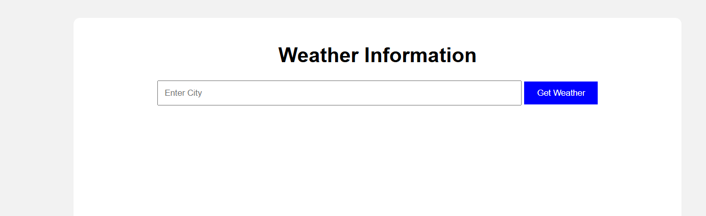
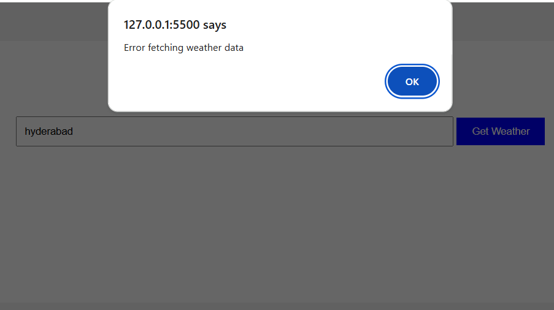

# Weather App using ES6

## Aim
To explore ES6 features like arrow functions, callbacks, promises, and async/await by implementing a weather application.

## Features
- Fetch weather information using OpenWeatherMap API
- Display weather data graphically
- Error handling using try-catch
- Responsive user interface

## ES6 Features Used
- Arrow Functions
- Async/Await
- Promises
- Fetch API
- Callbacks

## Technologies Used
- HTML5
- CSS3
- JavaScript ES6
- Chart.js
- OpenWeatherMap API

## Files Included
- index.html
- style.css
- script.js

## Output Screenshots

### Normal Output

### Error Handling Output

## GitHub Repository Link

https://github.com/malikabrar1897/weather-app-es6

## GitHub Pages Link

https://malikabrar1897.github.io/weather-app-es6/
